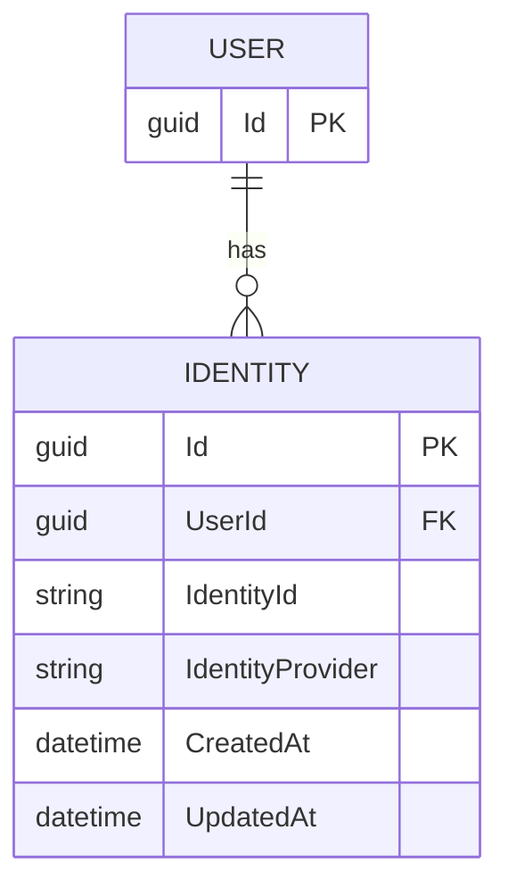

# Aggregate: Identity

## Purpose

A link between a `User` and an external account (Telegram, Google, GitHub, ...).

## Root

`Identity`, identified by `Identity.Id` (`Guid`).

## Composition

| Field              | Type                | Notes                                        |
|--------------------|---------------------|----------------------------------------------|
| `Id`               | `Guid`              | Internal surrogate key. Immutable.           |
| `UserId`           | `Guid`              | `Shadow property`. Reference to owning `User`. |
| `IdentityId`       | `string`            | External identifier inside the provider.     |
| `IdentityProvider` | `IdentityProvider`  | Enum: `Telegram`, `Google`, `GitHub`, ...    |
| `CreatedAt`        | `DateTime`          | Set once.                                    |
| `UpdatedAt`        | `DateTime`          | Bumped on mutation.                          |

## Invariants

- [`I1`](../invariants.md#i1) — `(IdentityProvider, IdentityId)` is unique across the system.
- [`I2`](../invariants.md#i2) — for a given `UserId`, at most one identity per provider.

Both are enforced by unique indexes on the `identity` table. The aggregate does
not check them itself; violations surface as domain errors from the repository.
See [invariants.md](../invariants.md) for the full catalogue.

## Behavior

| Method                                 | Effect                                    |
|----------------------------------------|-------------------------------------------|
| `Create(userId, provider, externalId)` | Factory. Sets `CreatedAt`.                |
| `ChangeExternalId(newExternalId)`      | Re-link to a different external account.  |
| `Touch()`                              | Bumps `UpdatedAt`.                        |

## ER diagram



## Lifecycle

```mermaid
stateDiagram
    [*] --> Linked : Create(userId, provider, externalId)

    Linked --> Linked : ChangeExternalId() <br/>bump UpdatedAt
    Linked --> Linked : Update(provider, externalId) <br/>bump UpdatedAt
    Linked --> Removed : Unlink()

    Removed --> [*]